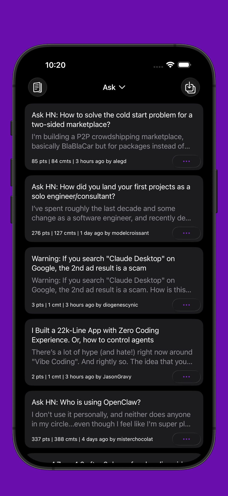

#  Gem for Hacker News

Gem is a [Hacker News](https://news.ycombinator.com/) client built with SwiftUI.

- [x] Log in using [Hacker News](https://news.ycombinator.com/) account.
- [x] Reply, vote, or flag.
- [x] Hacker News account favorites sync.
- [x] Home Screen and Lock Screen widget.
- [x] Launch Hacker News thread link from system share sheet.
- [x] Notification on new replies.
- [x] Offline mode.

  
  
  

  
  
  

