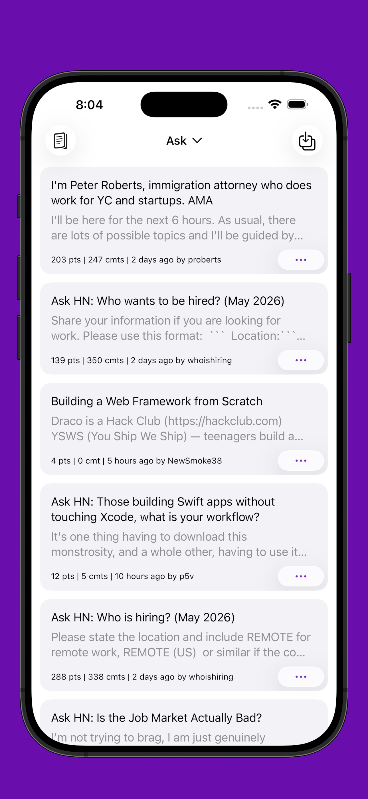
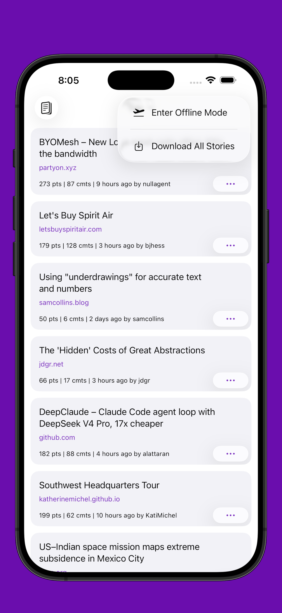
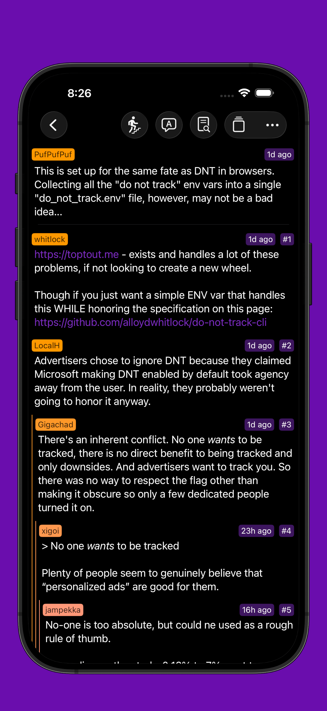
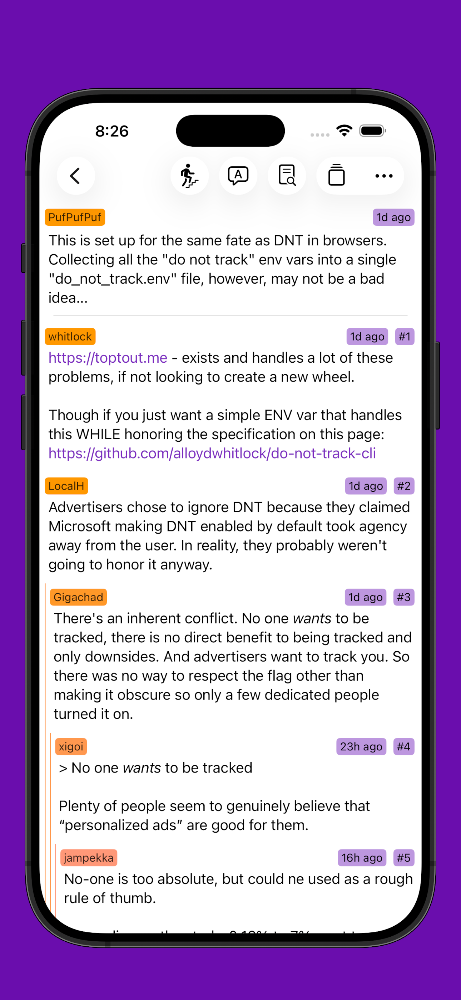
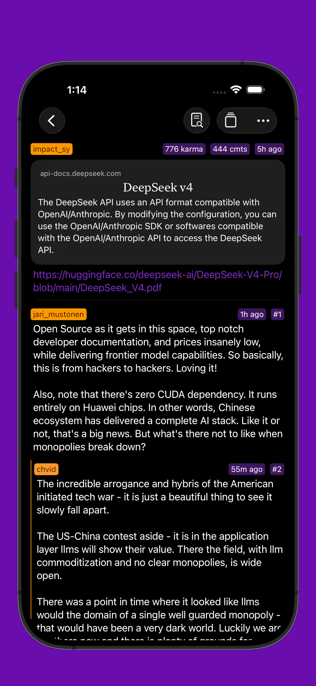
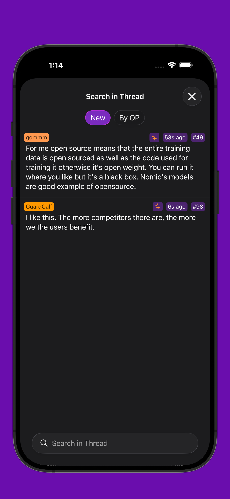
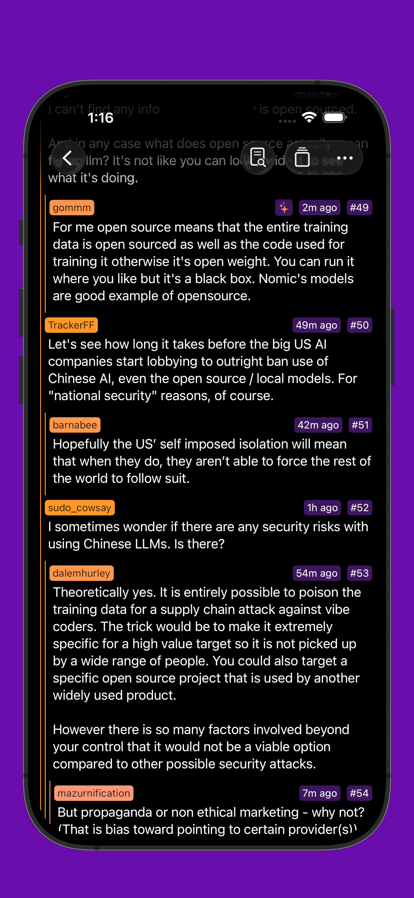
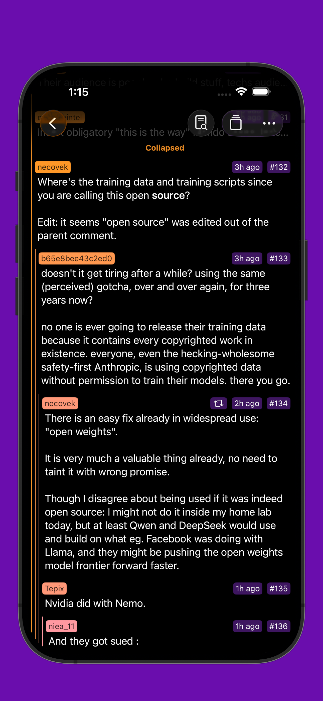

#  Gem for Hacker News

A [Hacker News](https://news.ycombinator.com/) client built with SwiftUI.

 

- [x] Log in using [Hacker News](https://news.ycombinator.com/) account
- [x] [Thread Translation](#thread-translation)
- [x] [Reply, vote, or flag](#thread)
- [x] [Hacker News account favorites sync](#pins-favorites-and-replies)
- [x] [Hacker News search](#search) 
- [x] Home Screen and Lock Screen widget
- [x] Launch Hacker News thread link from system share sheet
- [x] [Notification on new replies](#pins-favorites-and-replies)
- [x] [Offline mode](#offline-mode)
- [x] [New comments highlighting](#in-thread-search-new-comments-and-exchange-indicator) since last visit

## Home

  
  
  
  
  
  
  
  

## Thread

  
  
  
  
  
  
  
  

## Thread translation

  
  
  
  

## In-thread search, new comments and exchange indicator

  
  
  
  

## Pins, favorites, and replies

  
  
  
  

## Search

  
  
  
  

## Login

  
  
  
  
  
  
  
  

## Offline mode

  
  
  
  

